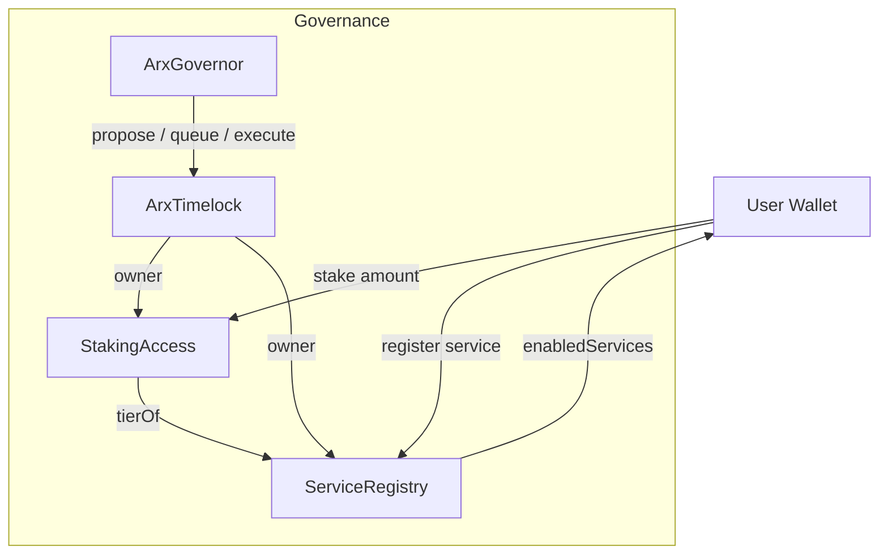

# ARX Token Sale Monorepo

Production-grade monorepo for ARX token, token sale, zap router and web app.

## What is ARX NET Slice?

ARX NET Slice ("ARX") is a 6‑decimal ERC‑20 token designed for governance and utility inside the ARX ecosystem. The project ships a complete on-chain sale architecture with upgradeable contracts, a zap router for 1‑click conversion (any token/ETH → USDC → ARX), and a modern web app to onboard users with clear quoting and slippage controls.

- Token: `ARX` (name: "ARX NET Slice", symbol: `ARX`, 6 decimals, Permit, Burnable, ERC20Votes)
- Sale: `ArxTokenSale` accepts USDC and mints ARX at an owner‑set price; forwards 100% of USDC to a treasury (silo)
- Zaps: `ArxZapRouter` takes ERC‑20/ETH, swaps to USDC via Uniswap V3, then calls `sale.buyFor()` to deliver ARX in a single transaction
- Frontend: Next.js app with wallet connect, token selector (USDC/ETH), Uniswap Quoter pricing, slippage controls, and live transaction preview

## Overview

- Smart contracts (Foundry):
  - `ARX` — ERC20 + Permit + Burnable + AccessControl (MINTER_ROLE) + ERC20Votes
  - `ArxTokenSale` — accepts USDC, forwards 100% to silo, mints ARX at USDC price
  - `ArxZapRouter` — swaps any ERC20/ETH to USDC via Uniswap V3, then `buyFor()`
  - `ArxGovernor` + `ArxTimelock` — upgradeable governance based on ERC20Votes + Timelock
  - `StakingAccess` — stake ARX (6‑dec) to reach access tiers (array‑based; defaults 1/10/100 ARX). Two‑step unstake with 30‑day cooldown.
  - `ServiceRegistry` — EOA self‑registration for services (Relay/VPN/Merchant and C\_\* variants) gated by staking tiers; includes `enabledServices(address)` view.
- Web app (Next.js):
  - Landing with parallax roadmap
  - `/buy` flow (wallet connect; quote via Uniswap Quoter; approvals/zap)
- Shared packages: UI, config (addresses/env), ABI
- Tooling: pnpm workspaces, Turborepo, ESLint/Prettier, Husky + lint-staged
- CI: GitHub Actions (lint + forge tests)

Price formula: `arxOut = (usdcAmount * 10^arxDecimals) / priceUSDC` (ARX uses 6 decimals).

## Current Testnet Deployment (Sepolia)

- ARX: `0x0cCDaB7eEf5a5071a39bBdbB0C3525D8780E3e1A`
- ArxTokenSale: `0xFBf0853e6962f219B7A414e548fA0239284A9246`
- ArxTimelock: `0x056a87133Be7674f4a4F99861FCCa4848b25f3d6`
- ArxGovernor: `0xe85755b07955155a2723458365452BC6C03FE7e6`
- StakingAccess: `0xF676135E8eE1239FA7C985fBe3742CF3BeB80b0C`
- ServiceRegistry: `0x4f5052F8bdf2e5CE3632CA8366055273c9F87AC8`
- ArxMultiTokenMerkleClaim: `0x1a2A187bC43cd95842Af42Ba7471636Be51FA091`

Use `scripts/deploy-sepolia.sh` (VERIFY=1 optional) to deploy, verify, and write `apps/web/.env.sepolia`.
Note: On Sepolia, USDC permit (EIP-2612) can reject; the web falls back to approve-only.

## Architecture & Contract Binding (Schema)

- Upgradeability
  - All core contracts are UUPS upgradeable behind `ERC1967Proxy` and initialized via `initialize(...)`.
  - Upgrades authorized by owner/admin in `_authorizeUpgrade`.

- Binding (addresses and roles)
  - `ArxTokenSale.USDC` → USDC ERC-20 (6 decimals)
  - `ArxTokenSale.ARX` → `ARX` token (UUPS proxy)
  - `ArxTokenSale.silo` → treasury that receives 100% of USDC
  - `ArxTokenSale.zappers` → allowlist for routers/zappers that can call `buyFor`
  - `ARX.MINTER_ROLE` → granted to `ArxTokenSale` so it can mint to buyers
  - `ArxZapRouter` holds: `USDC`, `WETH9`, `swapRouter (UniswapV3)`, and the bound `sale`
  - `GenericZapper` holds: `WETH9` and `swapRouter`

- Data flow (direct buy)
  1. User approves `ArxTokenSale` to spend USDC
  2. User calls `sale.buyWithUSDC(usdcAmount)`
  3. `sale` transfers USDC → `silo`, computes ARX, mints to `msg.sender`

- Data flow (zap + buy)
  1. User calls `ArxZapRouter.zapAndBuy` (or `zapETHAndBuy`) with a path that ends in USDC
  2. Router swaps input → USDC via Uniswap V3, output to router
  3. Router approves `sale` and calls `sale.buyFor(buyer, usdcOut)`
  4. `sale` transfers USDC → `silo`, mints ARX to `buyer`

- Generic Zapper (standalone)
  - `GenericZapper.zap(tokenIn, outToken, ...)` swaps ERC-20 or ETH to `outToken`, validates that `path` tail matches `outToken`, and immediately transfers outputs to `recipient` (no claim state).
  - Optional EIP-2612 permit supported via `(permitOwner, permitValue, permitDeadline, permitV, permitR, permitS)`; ETH path wraps via WETH9.

- Security & safety
  - Approvals: allowance-check + `forceApprove` (OZ v5) for non-standard tokens
  - Reentrancy: checks-effects-interactions; route swap output to self before external calls; clear allowances after use
  - Validation: revert on zero amounts; validate zap path last token (`USDC` for router, `outToken` for generic)
  - Pausable: routers/zappers are pausable; external zap functions guarded with `whenNotPaused`

- High-level schema (on-chain flows)

```
[User Wallet]
   |  approve USDC
   v
[ArxTokenSale (Proxy)] --USDC--> [Silo Treasury]
          |  mint
          v
      [ARX (Proxy)]  (to Buyer)

[User Wallet] --(ETH/ERC-20 + path)--> [ArxZapRouter]
      |           swap via Uniswap V3 to USDC (to router)
      v                                              |
  [ISwapRouter]  ------------------------------------
                                                   approve
                                                     |
                                                     v
                                 [ArxTokenSale.buyFor(buyer, usdc)]
                                                     |
                                                     v
                                   USDC -> Silo, ARX minted to buyer
```

## Governance & Voting

- Vote token: `ARX` implements `ERC20Votes` (upgradeable) with 6 decimals.
  - Holders can `delegate` to themselves or others; votes are checkpointed for `getVotes` queries.
  - Permit-enabled approvals and burnable supply.

- Timelock: `ArxTimelock` (UUPS + `TimelockControllerUpgradeable`)
  - Enforces a delay for queued proposals before execution.
  - Roles: `PROPOSER_ROLE`, `EXECUTOR_ROLE`, `CANCELLER_ROLE` (granted to governor by default in deploy script).

- Governor: `ArxGovernor` (UUPS + `Governor*Upgradeable`)
  - Counting: `GovernorCountingSimpleUpgradeable`
  - Votes: `GovernorVotesUpgradeable` (from ARX checkpoints)
  - Quorum: `GovernorVotesQuorumFractionUpgradeable` (configurable fraction)
  - Execution: `GovernorTimelockControlUpgradeable` (routes queue/execute through timelock)
  - Parameters set at init: quorum fraction, voting delay (blocks), voting period (blocks)

- Governance flow

```
[Holder] --delegate--> [Votes on ARX]
   |
   v
[Propose on Governor]
   |
   v  (if succeeded)
[Queue on Timelock] --delay--> [Execute via Timelock]
```

- Common operations
  - Delegate: call `ARX.delegate(address delegatee)`
  - Create proposal: `Governor.propose(targets, values, calldatas, description)`
  - Queue: `Governor.queue(..., descriptionHash)` (Timelock schedules batch)
  - Execute: `Governor.execute(..., descriptionHash)` (Timelock executes batch)

- Deploy script wiring (Sepolia)
  - Deploys ARX + Sale
  - Deploys `ArxTimelock` (delay from `TIMELOCK_DELAY`) and `ArxGovernor`
  - Grants `PROPOSER_ROLE` and `EXECUTOR_ROLE` to Governor on Timelock
  - Emits `.env` entries: `NEXT_PUBLIC_ARX_TIMELOCK`, `NEXT_PUBLIC_ARX_GOVERNOR`

## Access & Services (Staking + Registry)

- StakingAccess (`packages/contracts/src/services/StakingAccess.sol`)
  - Stake ARX (6‑dec) to gain access tiers.
  - Tier thresholds are a dynamic array passed at `initialize(arx, owner, uint256[] tiers)` and updatable via `setTiers(uint256[])` (owner‑only; intended for Timelock/Multisig). Defaults via deploy script: `[1_000_000, 10_000_000, 100_000_000]` (1/10/100 ARX).
  - Two‑step unstake with cooldown:
    - `requestUnstake(amount)`: moves amount to pending and starts a 30‑day cooldown.
    - `claimUnstaked()`: claim after cooldown, transferring tokens back.
  - Other functions:
    - `stake(amount)` (SafeERC20)
    - `tierOf(address)`: computes tier index based on current staked balance (excludes pending unstakes). Returns 0 if below first tier, otherwise number of thresholds met.
  - Ownership: UUPS + `OwnableUpgradeable` (Timelock/Multisig as admin)

- ServiceRegistry (`packages/contracts/src/services/ServiceRegistry.sol`)
  - EOA self‑registration of services gated by staking tier (requires `tier >= 1`).
  - Service types:
    - Core: `Relay`, `VPN`, `Merchant`
    - Consumer: `C_VPN`, `C_CLOUD`, `C_CARD`, `C_ESIM`, `C_SECURE_MODE`, `C_ULTRA`
  - Functions:
    - `register(serviceType, metadata)` → returns `serviceId` and enables the type for the user
    - `update(serviceId, metadata, active)` (owner‑only: the registrant; updates active state)
    - `enabledServices(address user)` → `ServiceType[]` of currently enabled types for the user
  - Ownership: UUPS + `OwnableUpgradeable` (Timelock/Multisig as admin)

- Access & Services flow

```
[User Wallet] --stake ARX--> [StakingAccess]
   |                             |
   | tierOf(user)                | holds staked ARX
   v                             v
[ServiceRegistry] <-- requires tier >= 1 -- register/update services
```

### Diagram: Services Architecture



- Deploy script wiring (Sepolia)
  - Deploys `StakingAccess` (owner=Timelock) with tier thresholds array
  - Deploys `ServiceRegistry` (owner=Timelock) with `staking=StakingAccess`
  - Emits `.env` entries: `NEXT_PUBLIC_STAKING_ACCESS`, `NEXT_PUBLIC_SERVICE_REGISTRY`

## Frontend: User Journey

1. Connect wallet (RainbowKit). App detects chain from `NEXT_PUBLIC_CHAIN_ID` and config.
2. Choose payment token: ETH or USDC.
   - USDC: approve sale and call `buyWithUSDC()`.
   - ETH: quote via Uniswap Quoter; if zap addresses are provided, call `zapETHAndBuy()`.
3. Set slippage and deadline; preview expected ARX.
4. Submit transaction and see confirmations.

## Repository Structure

```
apps/
  web/                 # Next.js app (Next 15, wagmi, viem, RainbowKit, Tailwind)
packages/
  contracts/           # Foundry contracts, tests, scripts
  abi/                 # Exported ABIs/types (placeholder JSON arrays)
  config/              # Addresses, constants, env-driven config
  ui/                  # Shared UI primitives (Tailwind-based)
```

## Prerequisites

- Node.js 18+ and pnpm 9+
- Foundry (forge/cast/anvil)
- GitHub CLI (optional)

## Install & Build

```bash
pnpm install --no-frozen-lockfile
pnpm -w run build
```

## Contracts

- Compile:

```bash
cd packages/contracts
forge build
```

- Test:

```bash
forge test -vv
```

### Local Deploy (Anvil)

1. Start Anvil

```bash
anvil -b 2
```

2. Deploy MockUSDC + ARX + Sale locally

```bash
cd packages/contracts
forge script script/LocalDeploy.s.sol --broadcast \
  --rpc-url http://127.0.0.1:8545 \
  --private-key 0xac0974bec39a17e36ba4a6b4d238ff944bacb478cbed5efcae784d7bf4f2ff80 -vv
```

Script logs will print deployed addresses for `USDC`, `ARX`, `SALE`.

## Web App - Local Run

Create `apps/web/.env.local` with local chain and addresses:

```bash
NEXT_PUBLIC_CHAIN_ID=31337
NEXT_PUBLIC_RPC_LOCAL=http://127.0.0.1:8545
NEXT_PUBLIC_ARX=<ARX_ADDRESS>
NEXT_PUBLIC_ARX_TOKEN_SALE=<SALE_ADDRESS>
NEXT_PUBLIC_USDC=<USDC_ADDRESS>
NEXT_PUBLIC_SILO_TREASURY=<YOUR_LOCAL_ADDRESS>
```

Start the web app:

```bash
pnpm -w --filter web dev
# http://localhost:3000
```

- Landing page shows hero and roadmap animation (respects reduced motion)
- `/buy` page:
  - Connect wallet
  - Local flow defaults to direct USDC -> `sale.buyWithUSDC`
  - On testnet/mainnet, you can quote via Uniswap Quoter and zap via Router

## Testnet (Sepolia/Base Sepolia) Deploy

Set env for scripts (example):

```bash
export RPC_URL=<https_rpc>
export PRIVATE_KEY=<0x...>
export USDC=<0x...>
export WETH9=<0x...>
export UNISWAP_V3_SWAPROUTER=<0x...>
export UNISWAP_V3_QUOTER=<0x...>
export SILO_TREASURY=<0x...>
export ARX_PRICE_USDC_6DP=<e.g., 5000000 for $5>
```

Deploy & wire in order:

```bash
pnpm -w --filter @arx/contracts run deploy:token
pnpm -w --filter @arx/contracts run deploy:sale
pnpm -w --filter @arx/contracts run deploy:zap
pnpm -w --filter @arx/contracts run wire:permissions
```

Populate `apps/web/.env.local` (or `.env`) with chain RPC and deployed addresses, then run `pnpm dev`.

## Claims (Merkle distributions)

- Contract: `src/claimable/ArxMultiTokenMerkleClaim.sol`
  - UUPS upgradeable; intended owner is Timelock/Multisig
  - Supports multiple Merkle roots per token (multiple rounds)
  - Tracks claims per `(user, root)`; `claim(token, totalAmount, proof)` pays `totalAmount - alreadyClaimed`

- Typical flow
  1. Owner adds Merkle root for a token
     - Root is computed over leaves `keccak256(abi.encodePacked(user, totalAmount))`
  2. Users call `claim(token, totalAmount, proof)`

- Example (Sepolia) using `cast` (assuming envs from the deploy script)

```bash
# Add a root (owner: timelock). For local demo, replace with OWNER pk.
cast send "$NEXT_PUBLIC_ARX_CLAIM" \
  "addMerkleRoot(address,bytes32)" \
  "$NEXT_PUBLIC_USDC" \
  0x<your_merkle_root> \
  --rpc-url "$RPC_URL" --private-key "$PRIVATE_KEY"

# User claims
cast send "$NEXT_PUBLIC_ARX_CLAIM" \
  "claim(address,uint256,bytes32[])" \
  "$NEXT_PUBLIC_USDC" 1000000 \
  "[0x<proof_hash_0>,0x<proof_hash_1>,...]" \
  --rpc-url "$RPC_URL" --private-key 0x<user_pk>
```

- Read helpers
  - `getMerkleRoots(token)` → `bytes32[]`
  - `getClaimedForTokenAndRoot(user, root)` → `uint256`
  - `getTotalClaimedForToken(user, token)` → `uint256`
  - `getTotalClaimedForAllTokens(user)` → `uint256`

## Packages

- `@arx/contracts`
  - `src/token/ARX.sol` — ERC20 + Permit + Burnable + AccessControl + ERC20Votes
  - `src/sale/ArxTokenSale.sol` — owner setters, zapper allowlist, forward-to-silo, mint
  - `src/zap/ArxZapRouter.sol` — Uniswap V3 exactInput to USDC, approves sale, calls `buyFor`
  - Governance:
    - `src/governance/ArxTimelock.sol` — Timelock (UUPS)
    - `src/governance/ArxGovernor.sol` — Governor (UUPS)
  - Services & Access:
    - `src/services/StakingAccess.sol` — ARX staking and tier computation
    - `src/services/ServiceRegistry.sol` — Tier‑gated registry for Relay/VPN/Merchant services
    - `src/claimable/ArxMultiTokenMerkleClaim.sol` — Multi-root Merkle claim for ERC20 distributions (UUPS)
  - Scripts:
    - `DeployToken.s.sol`, `DeploySale.s.sol`, `DeployZap.s.sol`, `WirePermissions.s.sol`
    - `LocalDeploy.s.sol` (Anvil: MockUSDC + ARX + Sale)
- `@arx/config`
  - `addressesByChain`: per-chain addresses via env
  - `constants`: slippage, deadline defaults
- `@arx/abi`
  - Minimal ABIs for app usage (update with codegen as needed)
- `@arx/ui`
  - Tailwind-based primitives (e.g., `Button`)

## Environment Variables

Contracts & Scripts:

- `CHAIN_ID`, `RPC_URL`, `PRIVATE_KEY`, `USDC`, `WETH9`, `UNISWAP_V3_SWAPROUTER`, `UNISWAP_V3_QUOTER`, `SILO_TREASURY`, `ARX_PRICE_USDC_6DP`

Web (Next.js):

- `NEXT_PUBLIC_CHAIN_ID`, `NEXT_PUBLIC_RPC_MAINNET`, `NEXT_PUBLIC_RPC_SEPOLIA`, `NEXT_PUBLIC_RPC_BASE_SEPOLIA`, `NEXT_PUBLIC_RPC_LOCAL`
- `NEXT_PUBLIC_ARX`, `NEXT_PUBLIC_ARX_TOKEN_SALE`, `NEXT_PUBLIC_ARX_ZAP_ROUTER`
- `NEXT_PUBLIC_USDC`, `NEXT_PUBLIC_WETH9`, `NEXT_PUBLIC_UNISWAP_V3_SWAPROUTER`, `NEXT_PUBLIC_UNISWAP_V3_QUOTER`, `NEXT_PUBLIC_SILO_TREASURY`
- `NEXT_PUBLIC_WALLETCONNECT_ID`

## CI

- `.github/workflows/ci.yml` runs lint and forge tests on PRs/pushes to `main`.

## Commands (Cheat Sheet)

```bash
# Build everything
pnpm -w run build

# Contracts
cd packages/contracts
forge build && forge test -vv

# Local deploy
anvil -b 2
forge script script/LocalDeploy.s.sol --broadcast --rpc-url http://127.0.0.1:8545 --private-key <key>

# Web app
cd ../../apps/web
pnpm dev
```

## Notes

- Front-end uses `viem` + `wagmi` + `RainbowKit`.
- Reduced-motion respected for animations.
- Permit2 is an optional future enhancement.

## License

MIT
